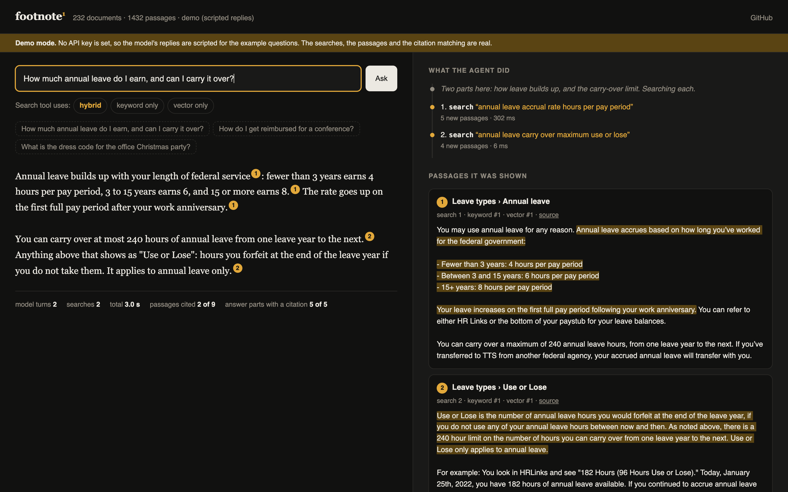
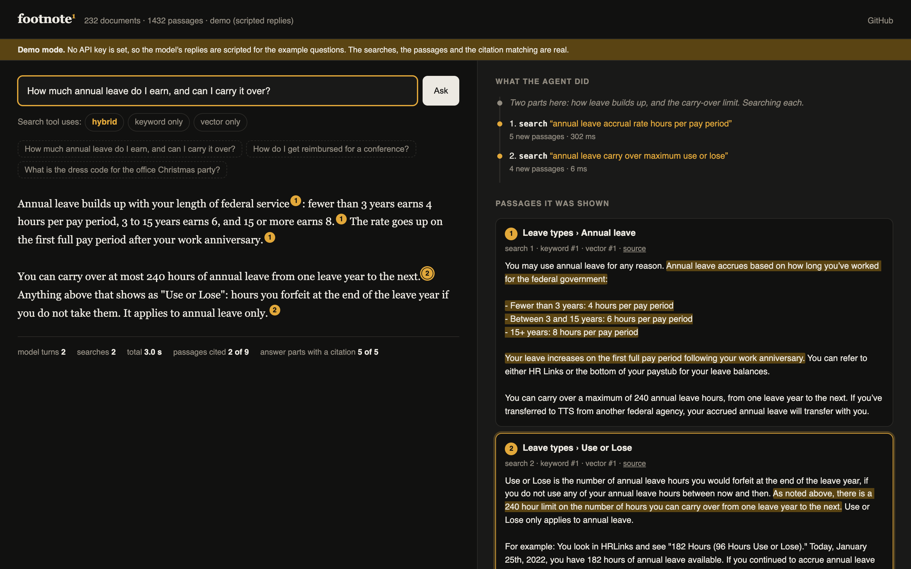
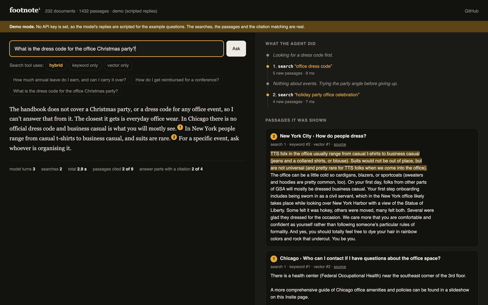
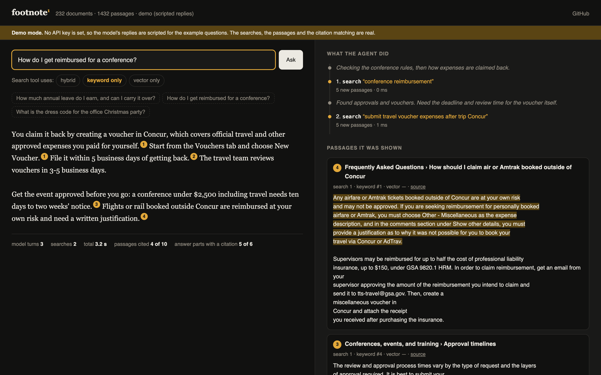

<h1 align="center">footnote<sup>1</sup></h1>

<p align="center">
  <strong>Ask your documents a question. Every claim in the answer links to the exact sentence it came from.</strong><br>
  Retrieval-augmented generation (RAG) done properly: hybrid search, Claude's native citations, and an eval suite that says how often it is right.
</p>

<p align="center">
  <a href="#what-it-does">What it does</a> ·
  <a href="#how-it-works">How it works</a> ·
  <a href="#does-it-work">Evals</a> ·
  <a href="#run-it">Run it</a> ·
  <a href="docs/deck.pdf">Slides (PDF)</a>
</p>

<p align="center">
  
  
  
  
</p>

<p align="center">
<!-- SHOT    -->
</p>

---

## Why

"Chat with your documents" is the most common thing companies ask an LLM to do, and the most common way it fails is quiet: the answer reads well, and one sentence in it came from nowhere. For an HR handbook, a contract or a runbook, the reader acts on that sentence.

footnote is built around one rule: **an answer you cannot check is not an answer.** The model may only use the passages the search step found, each sentence carries a citation, a click shows the source sentence highlighted in place, and when the documents do not cover the question it says so instead of guessing.

The demo corpus is the real [18F / TTS staff handbook](https://github.com/18F/handbook) (232 pages, public domain): leave, travel, expenses, hiring, tools. It is the kind of document set people actually ask questions of.

## What it does

### Answers with sentence-level citations

Each numbered chip is a citation returned by the Claude API, not text the model typed. The API guarantees the quoted span exists in the source passage, so a citation cannot point at a sentence that is not there.
<!-- SHOT 
 -->

### Click a citation, see the sentence

Clicking a chip scrolls to the passage and highlights the exact characters the claim rests on. The "source" link opens the original page.
<!-- SHOT 
 -->

### Says "not in the documents" instead of guessing

Ask about something the handbook does not cover and it tells you what is missing and what it did find nearby. The nearby material is still cited.
<!-- SHOT 
 -->

### Shows its search

Every passage shows where keyword search and vector search each ranked it. Switch between hybrid, keyword-only and vector-only to see how the result list changes for the same question.
<!-- SHOT 
 -->

### Reports what each answer cost

Search time, time to first word, total time, tokens and dollar cost are printed under every answer.

### Works from the terminal

```text
$ footnote ask "How much annual leave do I earn, and can I carry it over?"

Your annual leave accrual depends on your federal service length: fewer than 3 years earns
4 hours per pay period, between 3 and 15 years earns 6 hours, and 15+ years earns 8 hours.[1]
You can carry over a maximum of 240 annual leave hours from one leave year to the next.[2]
...
[1] Leave types › Annual leave  (travel-and-leave/leave.md)
[2] Leave types › Annual leave › Use or Lose  (travel-and-leave/leave.md)
```

## How it works

```
 markdown files
      │
      ▼
 ingest.py ── strip front matter, Liquid, HTML, link syntax
      │       split on headings, pack to ≤220 words,
      │       prefix each passage with "Page title › Section"
      ▼
 index.py ─── SQLite: passages + 384-d embeddings (bge-small, runs locally)
      │
 question ─┬─▶ BM25 keyword search (written here, ~25 lines) ─┐
           └─▶ vector search (cosine, numpy)                  ├─▶ weighted reciprocal rank fusion ─▶ top 8
                                                              ┘
      ▼
 answer.py ── each passage goes to Claude as a document block with citations enabled;
      │       the response streams back as text blocks + citation spans
      ▼
 server.py ── Server-Sent Events ─▶ web/index.html (one file, no build step)
```

Design decisions, and why:

- **Citations come from the API, not from the prompt.** Asking a model to write `[1]` after sentences produces markers that look right and are sometimes wrong. With [citations enabled](https://platform.claude.com/docs/en/build-with-claude/citations), Claude returns character offsets into the passage it used, and the API validates them. The UI only renders what the API returned.
- **Hybrid search, because each half fails differently.** Vector search misses exact terms (a form number, a tool name). Keyword search misses paraphrase ("time off" vs "annual leave"). Reciprocal rank fusion needs no score calibration between the two. The weights were tuned on the eval set below; see the caveat there.
- **Headings travel with the passage.** A paragraph that says "you can carry over 240 hours" is useless to a search engine without "Annual leave" attached. Each passage is indexed as `Page title › Section path` + text.
- **No vector database.** 1,400 passages × 384 floats is about 2 MB. A numpy matrix multiply searches it in well under a millisecond; end-to-end search is dominated by embedding the question (tens of milliseconds on CPU). SQLite holds everything in one file. A vector DB becomes worth its operational cost somewhere past a few hundred thousand passages.
- **Embeddings run locally.** `bge-small-en-v1.5` through ONNX: no second API key, no per-query cost, and documents never leave the machine for indexing.
- **Abstention is a requirement, not a hope.** The system prompt explains *why* guessing is harmful (readers act on the answer), and the eval suite includes questions the corpus cannot answer.

## Does it work?

All numbers below are produced by `evals/run.py` and stored in [`evals/results.json`](evals/results.json). Nothing is hand-entered.

### Search quality

59 questions, one correct passage each, 1,432 passages to choose from. "Found in top 8" matters most because 8 passages are what the model sees.

| Search mode | Correct passage is #1 | In top 3 | In top 8 | Right page in top 8 | MRR |
|---|---|---|---|---|---|
| Keyword only (BM25) | 28.8% | 55.9% | 64.4% | 76.3% | 0.415 |
| Vector only (bge-small) | 44.1% | 67.8% | 84.7% | 88.1% | 0.581 |
| **Hybrid (default)** | **45.8%** | **74.6%** | **84.7%** | **88.1%** | **0.608** |

Hybrid matches vector search on what reaches the model and ranks the right passage higher (top 3: +6.8 points). The first version, textbook fusion with equal weights, scored *below* vector-only (74.6% in top 8, MRR 0.580): on paraphrased questions keyword search is the weaker signal and was dragging good passages out of the list. Weighting vector results 70/30 fixed it. That regression only showed up because the eval existed.

How the questions were made: `evals/make_golden.py` samples passages from different pages and has Claude write the question a staff member would type, with instructions to avoid the passage's own wording. **Caveats:** synthetic questions are cleaner than real ones; 59 is a small set, so one question is worth 1.7 points; and the fusion weights were tuned on this same set, so the hybrid row is optimistic. The direction (keyword search alone is weak on paraphrased questions; fusion helps the top ranks) is the finding, not the second decimal.

### Answer quality

<!-- ANSWER_TABLE -->

## Run it

Needs Python 3.11+, [uv](https://docs.astral.sh/uv/) and an [Anthropic API key](https://console.anthropic.com/settings/keys).

```bash
git clone https://github.com/IbrarYunus/footnote && cd footnote
cp .env.example .env            # add ANTHROPIC_API_KEY
uv sync
uv run footnote ingest corpus/  # about 2 minutes on a laptop CPU; downloads a 64 MB embedding model once
uv run footnote serve           # http://127.0.0.1:8000
```

```bash
uv run footnote ask "Can I work from another country for a few weeks?"
uv run pytest                          # unit tests, no API calls
uv run python evals/run.py             # search evals, free and local
uv run python evals/run.py --answers   # answer evals, about $2.50 on Claude Opus 5
```

### Use your own documents

Point `ingest` at any folder of Markdown. Set `FOOTNOTE_SOURCE_URL_BASE` so "source" links go to your wiki or repo, then rebuild the question set with `uv run python evals/make_golden.py`.

| Setting | Default | Meaning |
|---|---|---|
| `FOOTNOTE_MODEL` | `claude-opus-5` | Answering model. `claude-sonnet-5` and `claude-haiku-4-5` also work. |
| `FOOTNOTE_EFFORT` | `low` | How much the model thinks before answering. |
| `FOOTNOTE_EMBED_MODEL` | `BAAI/bge-small-en-v1.5` | Any [fastembed](https://github.com/qdrant/fastembed) text model. |
| `FOOTNOTE_SOURCE_URL_BASE` | 18F handbook on GitHub | Prefix for source links. |

## Project layout

```
footnote/ingest.py    clean and chunk markdown               tests/          chunking, BM25, fusion
footnote/index.py     SQLite store, BM25, vectors, fusion    evals/          question set, scorer, results
footnote/answer.py    Claude call, citations, streaming      corpus/         18F handbook (CC0)
footnote/server.py    FastAPI + Server-Sent Events           web/index.html  the whole front end
footnote/cli.py       ingest · ask · serve                   docs/           slides, screenshots
```

About 600 lines of Python. No LangChain, no LlamaIndex: every step of the pipeline is short enough to read, which is the point of a reference implementation.

## What I would build next

- A cross-encoder reranker over the top 50, measured against the same question set before it is kept.
- Follow-up questions: rewrite "and for part-timers?" into a standalone query before searching.
- A harder eval set written by people, including questions whose answer spans two pages.
- Per-user access control at the passage level, so search never returns what the asker may not read.

## Credits

Corpus: the [18F Handbook](https://github.com/18F/handbook), a work of the United States Government, public domain and CC0. It is included unmodified under `corpus/` with its licence. 18F is not affiliated with this project.

## Author

**Ibrar Yunus**, AI engineer.

[ibraryunus.com/ai-engineer](https://ibraryunus.com/ai-engineer) · [LinkedIn](https://www.linkedin.com/in/ibrar-yunus/) · [GitHub](https://github.com/IbrarYunus)

footnote is the RAG piece of a small set of agentic AI and RAG projects. For the agentic side, see [groundwork](https://github.com/IbrarYunus/groundwork) (an agent that audits a codebase) and [frontdesk](https://github.com/IbrarYunus/frontdesk) (a support agent that can act on orders, with the money rules enforced in code).

MIT licensed.
